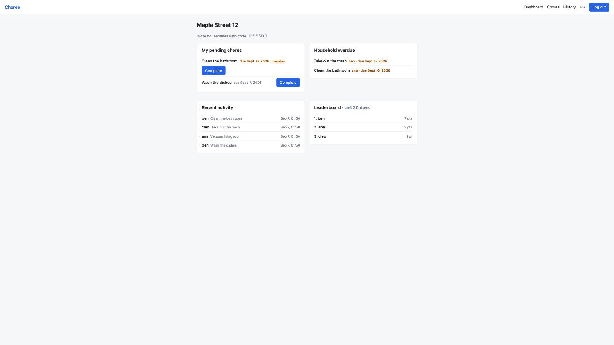
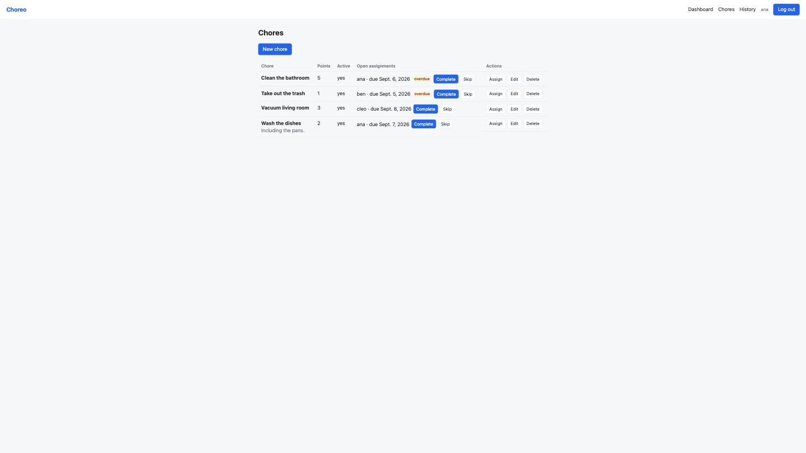
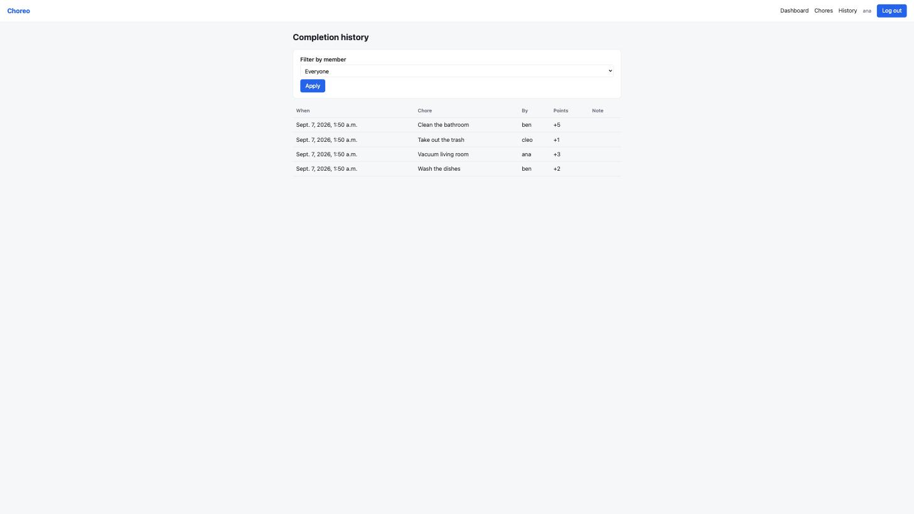
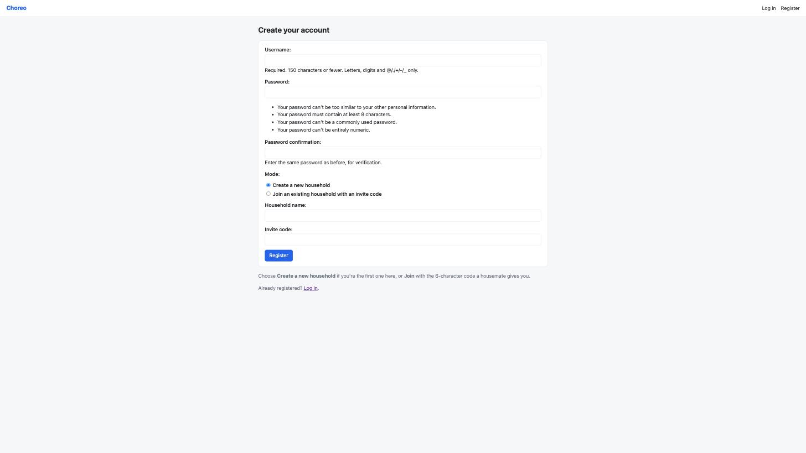

# Choreo — a shared household chores manager

A small Django web app where the people in one household keep a shared
catalogue of chores, assign them to each other with due dates, mark them done
with a permanent log, and see who owes what on a dashboard.

Built for **Homework 1 of the [AI Dev Tools Zoomcamp](https://github.com/DataTalksClub/ai-dev-tools-zoomcamp/)**
([`homework.md`](./homework.md)).

---

## The AI-native workflow

The homework starts from one vague line — *"a tool for managing shared
household chores"* — and the point is to turn it into working software the way
you would with an AI coding agent:

```
vague idea  →  spec  →  plan  →  backlog  →  implement task-by-task  →  tests
```

| Step | Artifact |
|------|----------|
| Brainstormed the idea into a scoped spec | [`_docs/spec.md`](./_docs/spec.md) |
| Turned the spec into an architecture + phased plan | [`_docs/plan.md`](./_docs/plan.md) |
| Wrote a granular, test-first coding plan | [`task.md`](./task.md) |
| Broke the plan into an ordered backlog | [`backlog.md`](./backlog.md) |
| Implemented each backlog item, committing after each | the `chores/` app |
| Covered every feature with tests | `chores/tests/` (60 tests) |

---

## Features

The spec settled on **four** features:

### 1. Chores CRUD
Each household keeps a catalogue of chores (`title`, optional `description`,
a `points` effort weight, an active flag). Any member can create, edit, or
delete them. Deleting a chore also removes its assignments. Every query is
scoped to the member's household — you can never see another household's
chores.

### 2. Assignments
A chore is assigned to a household member with a due date. The assignee list
is limited to people in the household. An assignment is **PENDING** until it is
**completed** or **skipped**, and it is **overdue** when it is still pending
past its due date. Complete and skip are POST-only actions.

### 3. Completion log
Completing an assignment writes an immutable `CompletionEvent`
(who, when, points awarded, optional note). The History page lists the
household's completions newest-first and can be filtered to one member.

### 4. Dashboard
The landing page after login, with four panels:
- **My pending chores** — your open assignments, overdue ones flagged.
- **Household overdue** — every overdue assignment across the household.
- **Recent activity** — the last 10 completion events.
- **Leaderboard** — points earned per member over the last 30 days, ranked.

It also shows the household's **invite code** so housemates can join.

### Auth
Register with a username and password, then either **create a new household**
(give it a name) or **join an existing one** with its 6-character invite code.
Login/logout use Django's built-in auth.

---

## Screens

| | |
|---|---|
|  |  |
| **Dashboard** — panels + invite code | **Chores** — catalogue, per-chore assignments, complete/skip |
|  |  |
| **History** — completion log, filterable | **Register** — create or join a household |

---

## Tech stack

- **Python** 3.12
- **Django** 5.2.17 (`>=5,<6`)
- **SQLite** (Django default)
- **[uv](https://docs.astral.sh/uv/)** for the virtual environment and dependencies
- Django's built-in test framework — no third-party packages, no JavaScript,
  no CSS framework (one hand-written stylesheet)

---

## Getting started

```bash
cd 01-ai-native-workflow

# create the venv and install Django from the lockfile
uv sync

# set up the database
uv run python manage.py migrate

# (optional) an admin account for /admin
uv run python manage.py createsuperuser

# run it
uv run python manage.py runserver
```

Open <http://127.0.0.1:8000/> and register.

### Demo data (optional)

`db.sqlite3` is git-ignored. To explore with a pre-populated household, run:

```bash
uv run python manage.py shell < _docs/seed_demo.py
```

That creates the household **"Maple Street 12"** with members `ana`, `ben`,
`cleo` (all password `demo-pass-123`), four chores, some open/overdue
assignments, and completion history.

---

## Running the tests

```bash
uv run python manage.py test
```

60 tests, all green (they run in well under a second — the settings switch to a
fast password hasher when `test` is in `sys.argv`).

| File | Covers |
|------|--------|
| `test_models.py` (13) | invite-code generation & uniqueness, `is_overdue` logic, `complete()` creates an event with the right points, `skip()` creates none, chore→assignment cascade |
| `test_auth.py` (10) | register→create household, register→join by code (case-insensitive), bad code rejected, login required, logout, no-membership fallback |
| `test_chores.py` (8) | list isolation, create attaches the right household, update, cascade delete, cross-household 404s, login required |
| `test_assignments.py` (9) | assignee limited to household, create → PENDING, complete records event + points, skip has no event, GET → 405, cross-household 404, safe `next` redirect |
| `test_history.py` (4) | newest-first ordering, household scoping, member filter, login required |
| `test_dashboard.py` (7) | my-pending scoping, overdue panel, recent-activity cap of 10, leaderboard 30-day window & ranking, zero-score members included, invite code shown |
| `test_isolation.py` (8) | one audit point: household A cannot list / edit / delete / assign / complete / skip / see history of household B |
| `test_journey.py` (1) | end-to-end: register → household → chore → assign → complete → dashboard + history → second member joins by code |

---

## Project layout

```
01-ai-native-workflow/
├── homework.md              # the assignment
├── README.md                # this file
├── task.md                  # the step-by-step coding plan
├── backlog.md               # ordered Django backlog
├── _docs/
│   ├── spec.md              # product spec (from brainstorming)
│   ├── plan.md              # architecture + phased plan
│   └── img/                 # screenshots
├── pyproject.toml           # uv project + deps
├── uv.lock
├── manage.py
├── household/               # Django project
│   ├── settings.py          #   <- the app is registered here
│   ├── urls.py
│   ├── wsgi.py / asgi.py
├── chores/                  # the app
│   ├── models.py            # Household, Membership, Chore, Assignment, CompletionEvent
│   ├── forms.py             # RegisterForm, HouseholdChoiceForm, ChoreForm, AssignmentForm
│   ├── views.py             # all views, each scoped to request.user's household
│   ├── urls.py
│   ├── admin.py
│   ├── migrations/
│   ├── static/chores/style.css
│   └── tests/               # 8 test modules, 60 tests
└── templates/
    ├── base.html
    ├── registration/        # login.html, register.html
    └── chores/              # dashboard, chore_list, chore_form, ...
```

---

## Data model

```
Household ──1:*── Membership ──1:1── User
    │
    1:*
    ▼
  Chore ──1:*── Assignment ──1:*── CompletionEvent
                   │                     │
                   *:1 assignee          *:1 completed_by
                   ▼                     ▼
                  User                  User
```

| Model | Fields |
|-------|--------|
| `Household` | `name`, `invite_code` (6 chars, auto, unique), `created_at` |
| `Membership` | `user` (1:1), `household` (FK), `display_name`, `joined_at` |
| `Chore` | `household` (FK), `title`, `description`, `points` (default 1), `is_active`, `created_at` |
| `Assignment` | `chore` (FK), `assignee` (FK→User), `due_date`, `status` (PENDING/DONE/SKIPPED), `completed_at`, `created_at` |
| `CompletionEvent` | `assignment` (FK), `completed_by` (FK→User), `completed_at`, `points_awarded`, `note` |

Business logic lives on the models: `Household.save()` generates the invite
code, `Assignment.is_overdue()`, `Assignment.complete(user, note="")` (creates
the `CompletionEvent`, idempotent), `Assignment.skip()`.

---

## Homework answers

| # | Question | Answer |
|---|----------|--------|
| **Q1** | Coding agent used | **Claude Code** |
| **Q2** | Features the spec settled on | **Chores CRUD**, **Assignments**, **Completion log**, **Dashboard** (with a 30-day points leaderboard) |
| **Q3** | File to edit to include the app in the project | **`settings.py`** (`INSTALLED_APPS`) |
| **Q4** | Task 1 in the backlog | **Project setup** — create the `uv` project, install Django, generate the `household` project and `chores` app, and register the app in `settings.py` |
| **Q5** | Command to start the dev server | **`uv run python manage.py runserver`** |
| **Q6** | Command to run the tests | **`uv run python manage.py test`** |

---

## Out of scope (deliberately)

Recurring / auto-rotating chores, notifications, a REST API, multiple
households per user, roles beyond "member", and any deployment config. See
[`_docs/spec.md` §9](./_docs/spec.md).
